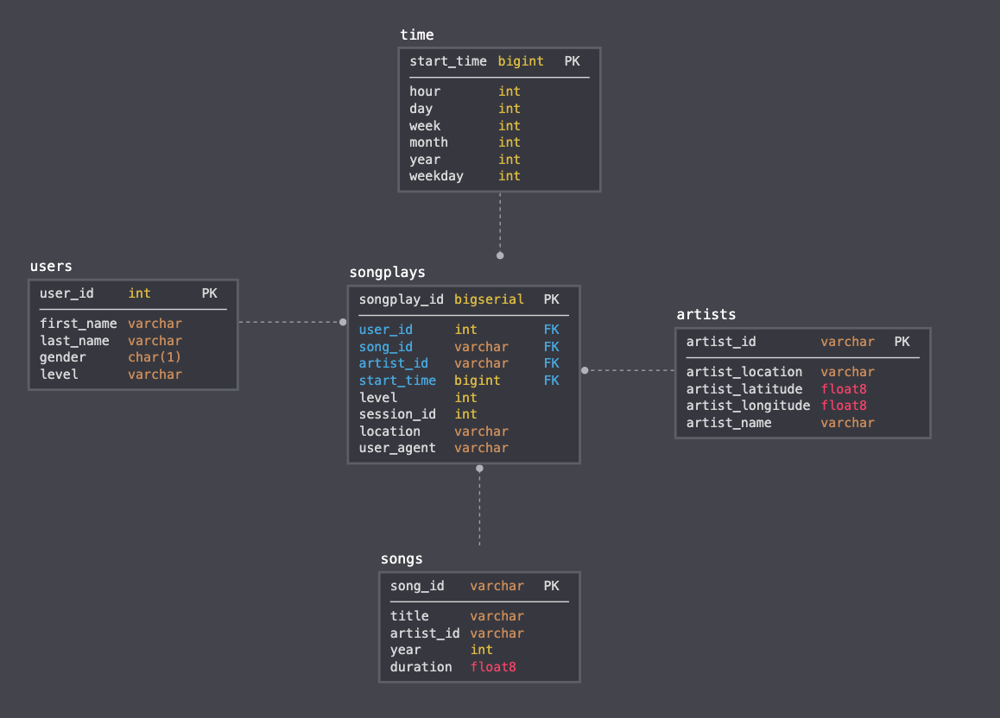

## Introduction

Introduction
A startup called Sparkify wants to analyze the data they've been collecting on songs and user activity on their new music streaming app. The analytics team is particularly interested in understanding what songs users are listening to. Currently, they don't have an easy way to query their data, which resides in a directory of JSON logs on user activity on the app, as well as a directory with JSON metadata on the songs in their app.

They'd like a data engineer to create a Postgres database with tables designed to optimize queries on song play analysis, and bring you on the project. Your role is to create a database schema and ETL pipeline for this analysis. You'll be able to test your database and ETL pipeline by running queries given to you by the analytics team from Sparkify and compare your results with their expected results.

## Project Description
In this project, you'll apply what you've learned on data modeling with Postgres and build an ETL pipeline using Python. To complete the project, you will need to define fact and dimension tables for a star schema for a particular analytic focus, and write an ETL pipeline that transfers data from files in two local directories into these tables in Postgres using Python and SQL.

Base on the project introdaction and descripttion the The analytics team in the Sparkify want to analyst the songs users are listening so this is OLAP  and the anlyst team agree to use star schema for that:

The star schema design it is consist a fact table referencing  any number of dimension tables   

And much more complex business logics can be easily solved using the STAR schema method.

## Schema for Song Play Analysis
Using the song and log datasets, you'll need to create a star schema optimized for queries on song play analysis. This includes the following tables.

* Fact Table
 1. songplays - records in log data associated with song plays i.e. records with page NextSong 
     - songplay_id, start_time, user_id, level, song_id, artist_id, session_id, location, user_agent
* Dimension Tables
 2. users - users in the app
     - user_id, first_name, last_name, gender, level
3. songs - songs in music database
    - song_id, title, artist_id, year, duration
4. artists - artists in music database
    - artist_id, name, location, latitude, longitude
5. time - timestamps of records in songplays broken down into specific units
    - start_time, hour, day, week, month, year, weekday
 This database will help the internal departments of the Sparkify company to do different analysis to help users to see th hit music.
 look to queries that may Sparkify they need it to analyse the users.

`SELECT COUNT(level) FROM users;`

Day of the week music most frequently listened to.

`SELECT COUNT(weekday) FROM time;`

Or, hour of the day music most often listened to.

`SELECT COUNT(hour) FROM time;`

 

## ETL ETL Processes
1. Created **songs**, **artist** dimension tables from extracting songs_data by selected columns from json files using panda and Created **users**, **time** dimension tables from extracting log_data by selected columns.
2. Created the most important table fact table from the dimensison tables and log_data called **songplays**. 

 
## How to work and what contain?
1. **sql_queries.py**:  written CREATE statements in sql_queries.py to create each table and written DROP statements in sql_queries.py to drop each table if it exists.
2. **create_tables.py**: is  to create your database and tables.
3. **etl.ipynb**: rto develop ETL processes for each table
4. **etl.py**:   read  and process files from song_data and log_data and load them to tables. 
   
    

## steps for run files

1. create_tables.py
          $ python3 create_tables.py 
2.  etl.ipynb / etl.py
          $ python3 etl.py
3. test.ipynb